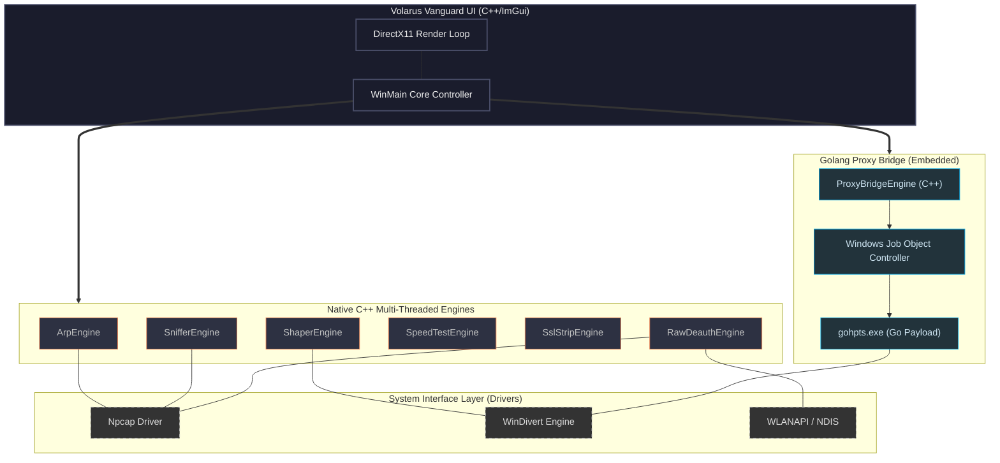

# Volarus Vanguard V.1.0

> **Empowering Network Intelligence – Professional-Grade Deep Packet Inspection & Proxy Orchestration Suite.**

**Volarus Vanguard** is a high-performance network management and security console developed by **Alta Volare**. It consolidates a wide array of low-level network utilities—ranging from Layer 2 ARP manipulation to Application Layer proxying and SSL stripping—into a single, unified C++ interface powered by ImGui.

---

## 🚀 Key Features

### 📡 Network Mapping & Discovery
- **Native ARP Scanner**: High-speed Layer 2 discovery for auditing local subnets.
- **Deep SOCKS Mapper**: A unique Golang-powered network mapper that routes TCP-connect streams through SOCKS proxies to enumerate remote or segmented targets without Layer 2 noise.

### 🛡️ Traffic Control & Shaping
- **Bandwidth Shaper**: Granular control over upload/download speeds per target using the WinDivert engine.
- **Connection "CUT"**: Instantly disconnect specific devices from the network for security or management purposes.
- **Transparent Proxy (TProxy)**: Seamlessly intercept and route TCP/UDP traffic without client-side configuration.

### 🔍 Deep Packet Analysis
- **Vanguard Sniffer**: Promiscuous mode packet capture for total subnet visibility.
- **MShark (Proxy PCAP)**: A specialized internal capture engine designed specifically for analyzing traffic traversing the Golang proxy bridge (HTTP/TLS/DNS).
- **SSL Strip**: Intercept and downgrade HTTPS traffic to plain HTTP to audit sensitive application flows.

### 📶 Wireless Intelligence
- **Native Deauth Engine**: Targeted WiFi deauthentication for security testing.
- **Rogue AP Deception**: Advanced "Karma" style modules for identifying and auditing nearby wireless configurations.

### ⚡ Performance Analytics
- **Precision Speedtest**: Highly accurate latency, jitter, and bandwidth metrics routed through globally distributed Cloudflare endpoints.

---

## 🏗️ Technical Architecture

Volarus Vanguard utilizes a hybrid architecture to combine the raw speed of **Native C++** with the flexibility of the **Golang** networking ecosystem.

### Dependency Stack
- **Frontend**: ImGui + DirectX11.
- **Language Core**: C++20 (MSVC) + Go 1.21.
- **Network Interface**:
    - `Npcap`: Promiscuous mode capture and raw frame injection.
    - `WinDivert`: Layer 3/4 packet interception and routing.
    - `Winsock2`: Native Windows hardware-accelerated sockets.

---

## 🛠️ Build & Installation

Volarus Vanguard follows a monolithic build approach where the Golang binary is **embedded as a resource** within the C++ executable.

1. **Requirements**:
    - Windows 10/11 (x64)
    - Administrator Privileges
    - Npcap 1.75+ installed in WinPcap Compatible Mode
2. **Compilation**:
    Run `build.bat` from the root directory. The script will automatically:
    - Compile the Go proxy component.
    - Embed the binary into a `.res` file.
    - Compile the C++ Vanguard console.
    - Link all libraries and output `VolarusVanguard.exe` in `build/Release/`.

---

## 🛡️ Disclaimer
*Volarus Vanguard is a specialized tool intended strictly for authorized network auditing, educational research, and internal network management. The developers (Alta Volare) are not responsible for any misuse or illegal activity performed with this software.*
