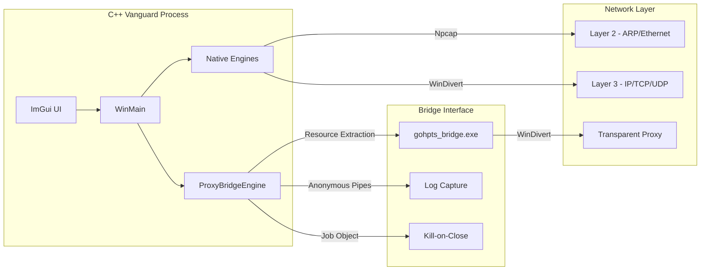

# Volarus Vanguard - Technical Documentation

## 1. Executive Summary
**Volarus Vanguard** is a sophisticated, high-performance network intelligence and security orchestration suite. It combines low-level C++ network engineering with a flexible Go-based proxy ecosystem to provide real-time Deep Packet Inspection (DPI), traffic shaping, and Layer 2/3 manipulation.

---

## 2. System Architecture

Volarus Vanguard utilizes a **Hybrid Multi-Engine Architecture**. The application is primarily written in **C++20** for raw performance and driver interaction, while offloading complex application-layer proxying to an **embedded Go-based engine**.

### 2.1 The Bridge Mechanism
The "Bridge" is a unique design pattern where a Golang networking binary (`gohpts.exe`) is embedded as a resource within the C++ executable.
- **Extraction**: On startup, the `ProxyBridgeEngine` extracts the Go binary to the system's `%TEMP%` directory.
- **Execution**: It launches the process with hidden window flags and redirects `stdout`/`stderr` to a pipe.
- **Orchestration**: A Windows **Job Object** is used to bind the C++ and Go processes together, ensuring that if the UI is closed, the proxy engine is guaranteed to terminate.

---

## 3. Core Engines & Mechanics

### 3.1 ArpEngine (Layer 2 Intelligence)
The `ArpEngine` is the foundation for network discovery and MITM operations.
- **Passive Discovery**: Listens for ARP traffic to identify new devices and their MAC addresses.
- **Active Scanning**: Performs multi-pass subnet sweeps using custom-crafted ARP requests, adapting to the network's CIDR prefix.
- **Heuristics**: 
    - **OS Detection**: Analyzes ICMP TTL (Time-To-Live) values. (e.g., TTL 64 = Linux/Android, TTL 128 = Windows).
    - **Vendor Lookup**: Uses an internal OUI table of ~80 major manufacturers.
    - **Conflict Detection**: Monitors for IP conflicts where multiple MACs claim the same IP.
- **Enforcement**: Supports both "MITM" (routing traffic through the local host) and "Void" (poisoning the target with a fake MAC to cut their connection).

### 3.2 SnifferEngine (Deep Packet Inspection)
Powered by `Npcap`, this engine provides promiscuous mode capture.
- **Protocol Support**: Decodes Ethernet, ARP, IPv4, IPv6, TCP, UDP, ICMP, IGMP, and GRE.
- **Activity Intelligence**:
    - **DNS Parsing**: Maps IP addresses to domain names in real-time.
    - **TLS SNI Extraction**: Parses the `ClientHello` extension to identify encrypted hostnames.
    - **HTTP Host Parsing**: Extracts host headers and full URLs from unencrypted traffic.
- **Categorization**: Automatically classifies domains into categories like "Social Media," "Streaming," "Gaming," etc.

### 3.3 ShaperEngine (Traffic Control)
Uses the `WinDivert` kernel driver to intercept packets at the network stack.
- **Flow Control**: Implements a token-bucket-style throttling mechanism.
- **Packet Re-injection**: Intercepted packets are modified (delayed or dropped) and then re-injected into the network stack for seamless transparent control.

### 3.4 SslStripEngine
A specialized module that intercepts HTTP/HTTPS traffic to perform downgrade attacks.
- **Mechanism**: Replaces `https://` links with `http://` in real-time during the proxy transit.
- **Visibility**: Allows auditing of sensitive credentials that would otherwise be hidden by TLS.

---

## 4. Data Flow Logic

1. **Interception**: A packet is captured by `Npcap` (Sniffer) or intercepted by `WinDivert` (Shaper/Proxy).
2. **Analysis**: The `SnifferEngine` parses the packet headers and extracts metadata (SNI, DNS, IPs).
3. **Decision**: Based on UI settings (Throttling, Cutting, Proxying), the packet is either:
    - Passed through untouched.
    - Delayed/Modified (Shaper).
    - Routed to the Go Proxy Bridge (TProxy).
    - Dropped (CUT).
4. **Logging**: Statistics (Bytes In/Out, Packets Per Second) are updated in thread-safe atomic counters for the ImGui render loop.

---

## 5. Build System

Volarus Vanguard uses a monolithic build approach:
1. **Go Compilation**: The `gohpts` proxy is compiled first.
2. **Resource Embedding**: The resulting binary is converted into a Windows Resource file (`.rc`).
3. **C++ Compilation**: The main application is compiled using MSVC (C++20).
4. **Linking**: Libraries like `wpcap.lib`, `WinDivert.lib`, and `d3d11.lib` are linked to produce the final `VolarusVanguard.exe`.

---

## 6. Dependencies
- **Npcap SDK**: Required for raw frame injection and promiscuous capture.
- **WinDivert**: Required for kernel-level packet interception and shaping.
- **Dear ImGui**: Provides the high-performance DirectX11-based user interface.
- **Winsock2**: Core Windows networking.
- **WlanAPI**: Used for WiFi SSID and hardware discovery.

---

> [!IMPORTANT]
> **Volarus Vanguard** operates at the kernel level and requires Administrative privileges to initialize the `WinDivert` and `Npcap` drivers.
